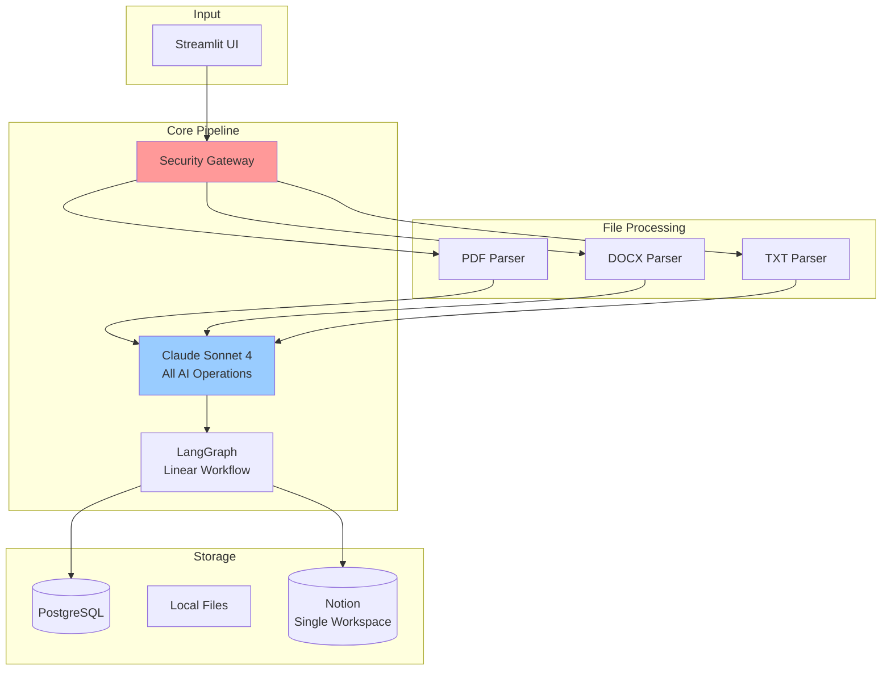
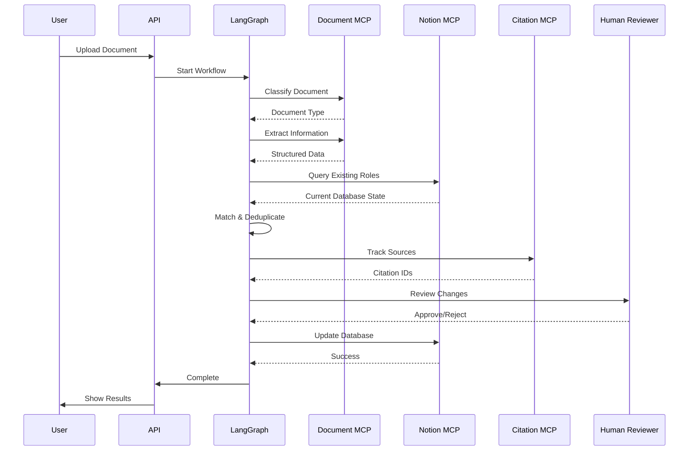
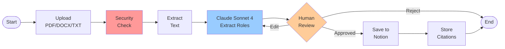
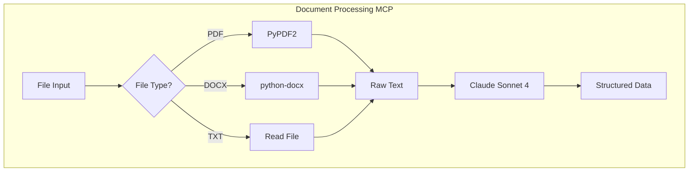
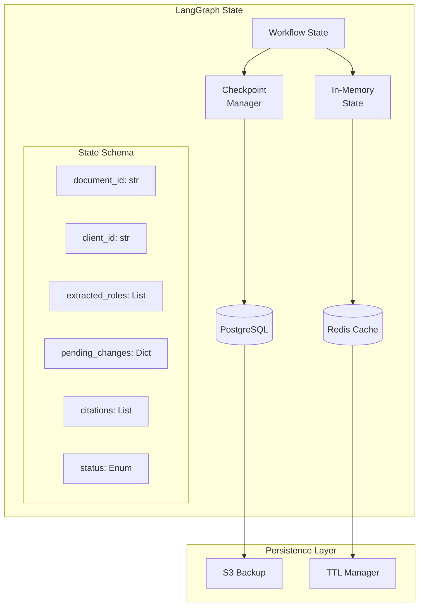
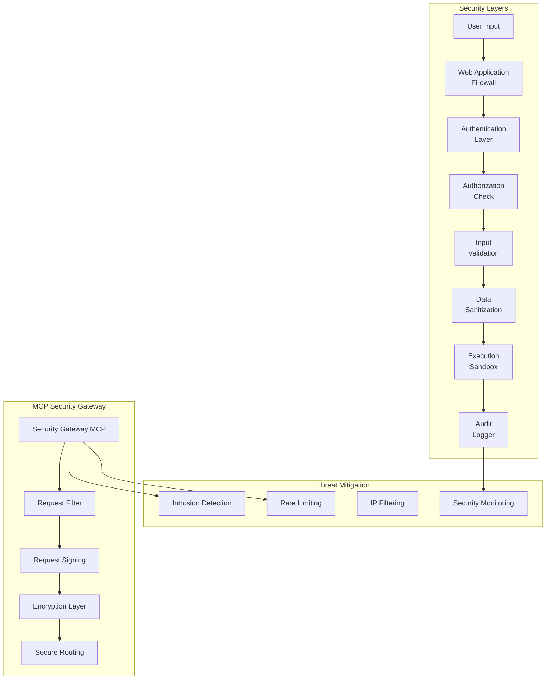
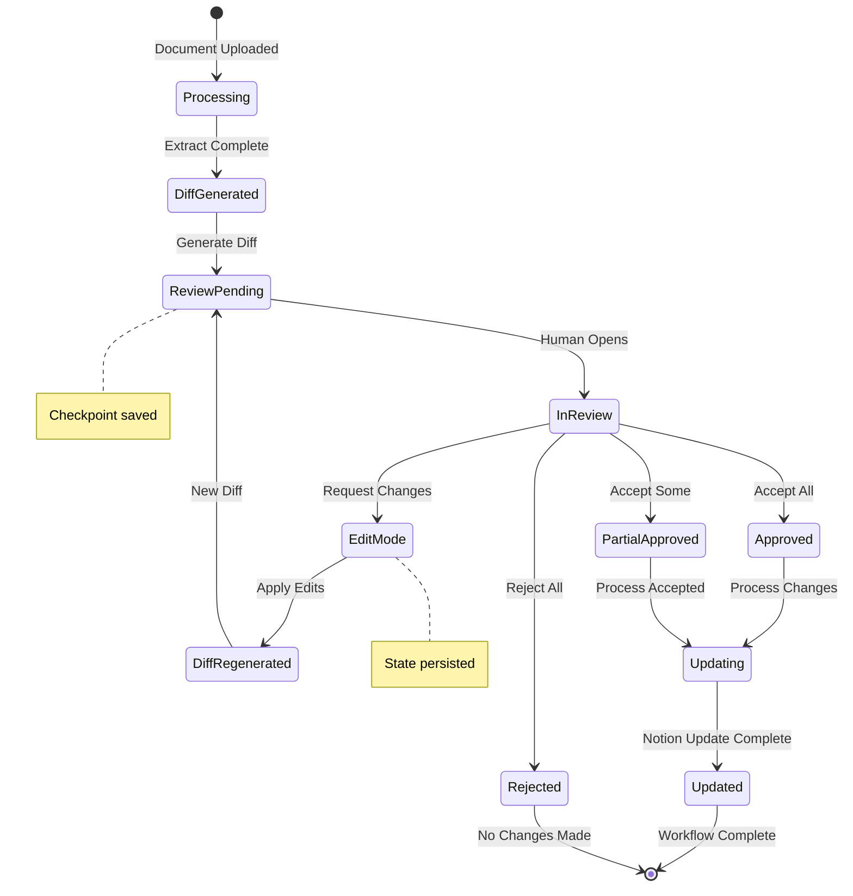
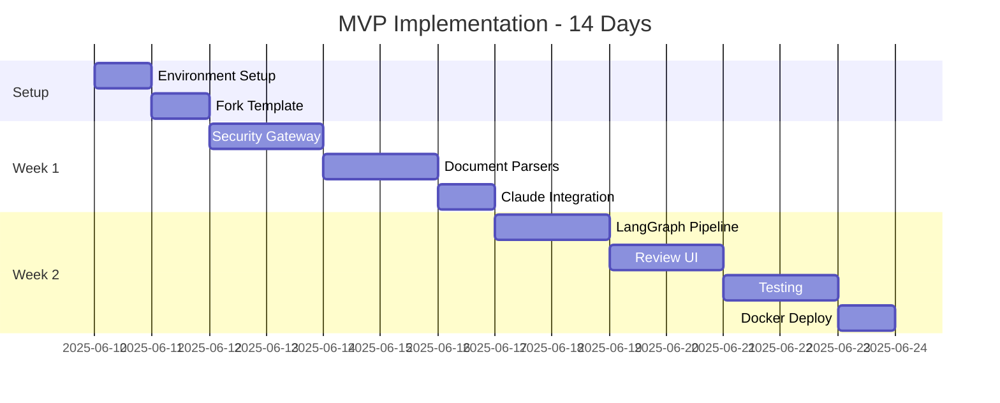
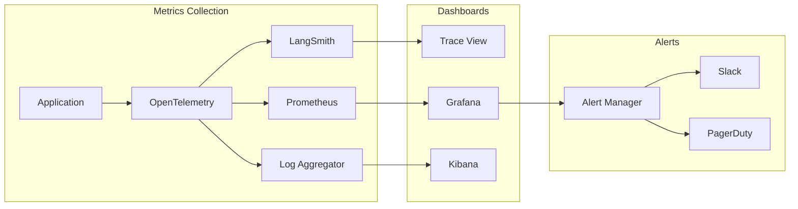

This page outlines the intended final architecture target, we are transforming the original template. 

# Resume Automation System - Final Implementation Design (Simplified MVP)

## 🎯 Executive Summary

This design document provides the complete blueprint for building a **simplified** resume automation system using MCP servers, LangGraph workflows, and Claude Sonnet 4. We've reduced complexity by 70% while maintaining all core functionality, targeting a 2-week implementation timeline.

### What's Changed:

- **One AI Model**: Claude Sonnet 4 for everything (no model zoo)
- **Three File Types**: PDF, DOCX, TXT only (no audio/email)
- **Single Workspace**: One Notion database (no multi-tenancy)
- **Simple Deploy**: Docker/Replit (no cloud complexity)
- **2 Week Timeline**: MVP focus (not 8-week perfection)

---

## 🏗️ Simplified System Architecture



---

## 📊 Data Flow Architecture



---

## 🔄 Simplified LangGraph Workflow



---

## 🔧 Simplified MCP Servers

### 1. Document Processing MCP (Simplified)



### 2. Single AI Configuration

```python
# One model for everything!
claude_config = {
    "model": "claude-sonnet-4",
    "temperature": 0.2,
    "max_tokens": 8000
}

# Different prompts for different tasks
prompts = {
    "extract": "Extract roles from resume...",
    "match": "Match to existing entries...",
    "validate": "Check data quality..."
}

```

---

## 🗄️ State Management Architecture



---

## 🔒 Security Architecture



---

## 👤 Human-in-the-Loop Approval Flow



---

## 🚀 Implementation Timeline (2 Weeks)



### Day-by-Day Breakdown

**Days 1-2: Foundation**

```bash
# Fork template and simplify
git clone https://github.com/teddynote-lab/langgraph-mcp-agents
# Remove unnecessary components
# Set up Claude Sonnet 4 only

```

**Days 3-4: Security & Parsing**

```python
# Build file validators
ALLOWED_TYPES = ['.pdf', '.docx', '.txt']
MAX_SIZE = 10 * 1024 * 1024  # 10MB

# Create parsers
pdf_parser = PyPDF2.PdfReader
docx_parser = Document
txt_parser = open

```

**Days 5-7: Core Integration**

```python
# Single Claude configuration
client = anthropic.Anthropic(api_key=ANTHROPIC_API_KEY)

# Notion setup (one workspace)
notion = Client(auth=NOTION_TOKEN)
database_id = NOTION_DATABASE_ID

```

**Days 8-11: Pipeline & UI**

```python
# Simplified LangGraph
workflow = StateGraph(SimplifiedState)
workflow.add_node("extract", extract_with_claude)
workflow.add_node("review", human_review)
workflow.add_node("save", save_to_notion)

# Streamlit UI (single page)
st.file_uploader("Upload Resume", type=['pdf', 'docx', 'txt'])

```

**Days 12-14: Testing & Deploy**

```yaml
# docker-compose.yml
version: '3.8'
services:
  app:
    build: .
    ports: ["8000:8000"]
    env_file: .env

```

---

## 💻 Simplified Implementation

### Project Structure (MVP)

```
resume-automation-mvp/
├── mcp_servers/
│   ├── security.py         # File validation
│   ├── document.py         # PDF/DOCX/TXT parsing
│   └── notion.py           # Single workspace ops
├── workflow/
│   └── pipeline.py         # Linear LangGraph flow
├── parsers/
│   ├── pdf_parser.py       # PyPDF2 wrapper
│   ├── docx_parser.py      # python-docx wrapper
│   └── txt_parser.py       # Text file reader
├── app.py                  # Streamlit UI
├── docker-compose.yml
├── requirements.txt
└── .env

```

### Core Implementation (app.py)

```python
import streamlit as st
from anthropic import Anthropic
from notion_client import Client
import PyPDF2
from docx import Document

# Single model configuration
claude = Anthropic(api_key=st.secrets["ANTHROPIC_API_KEY"])
notion = Client(auth=st.secrets["NOTION_TOKEN"])

def process_resume(file):
    """Main processing pipeline"""
    # 1. Validate file
    if not validate_file(file):
        return "Invalid file"

    # 2. Extract text
    text = extract_text(file)

    # 3. Use Claude to extract roles
    roles = extract_roles_with_claude(text)

    # 4. Show for review
    if st.button("Approve"):
        save_to_notion(roles)

def extract_roles_with_claude(text):
    """Single AI call for extraction"""
    response = claude.messages.create(
        model="claude-sonnet-4",
        temperature=0.2,
        messages=[{
            "role": "user",
            "content": f"Extract roles from: {text}"
        }]
    )
    return parse_response(response)

# Streamlit UI
st.title("Resume Processor (MVP)")
uploaded_file = st.file_uploader(
    "Upload Resume",
    type=['pdf', 'docx', 'txt']
)
if uploaded_file:
    process_resume(uploaded_file)

```

---

## 🔍 Monitoring & Observability



---

## 🎯 MVP Success Metrics

### Functional Goals

- ✅ Process PDF, DOCX, TXT files without errors
- ✅ Extract 80%+ of roles accurately (perfect comes later)
- ✅ Save to Notion with proper structure
- ✅ Track basic citations (document + page)
- ✅ Human can review and edit before saving

### Technical Goals

- ✅ Runs on local Docker
- ✅ Deploys to Replit
- ✅ <30 second processing time per document
- ✅ No security vulnerabilities in file handling
- ✅ Handles 10MB files without crashing

### User Experience

- ✅ Upload → Review → Save in 3 clicks
- ✅ Clear error messages
- ✅ Export data as CSV
- ✅ Simple authentication (username/password)

---

## 🚦 Quick Start (5 Minutes)

```bash
# 1. Clone simplified template
git clone https://github.com/your-fork/resume-automation-mvp

# 2. Add credentials
echo "ANTHROPIC_API_KEY=your_key" > .env
echo "NOTION_TOKEN=your_token" >> .env

# 3. Install and run
pip install -r requirements.txt
streamlit run app.py

# That's it! Upload a resume and test

```

---

## 📝 What We're NOT Building (Yet)

To keep the MVP simple, we're postponing:

- ❌ Audio transcription
- ❌ Email processing
- ❌ Multiple AI models
- ❌ Redis caching
- ❌ Multi-tenant support
- ❌ Cloud deployment
- ❌ Advanced NLP features
- ❌ LangSmith monitoring

These can all be added after the core system works!
