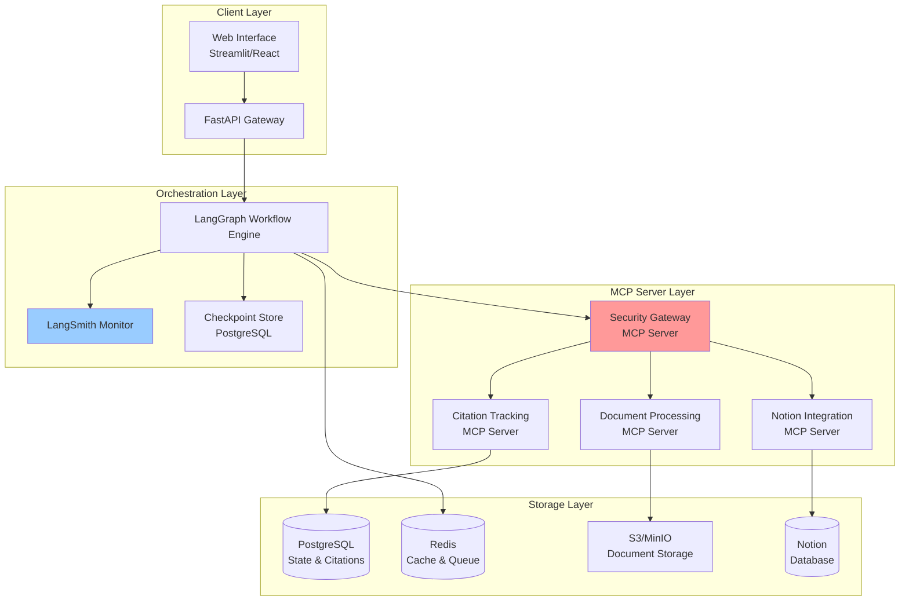
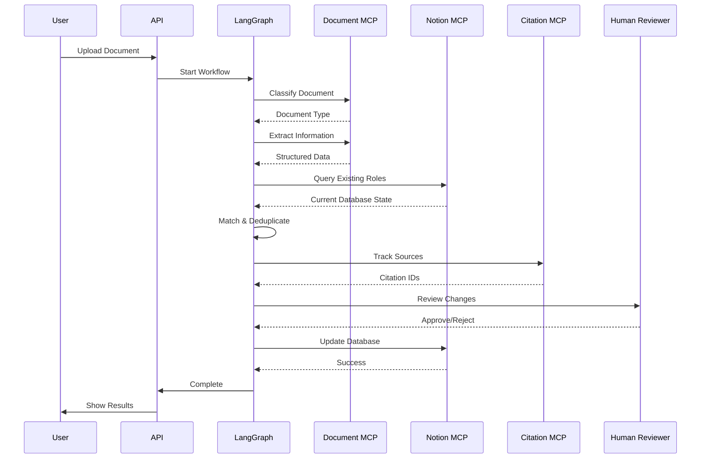
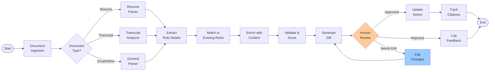
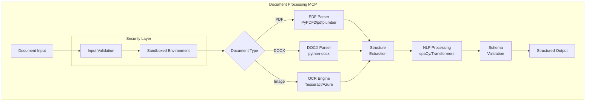
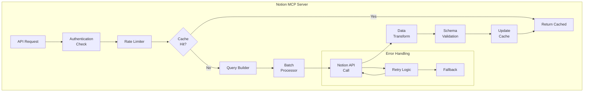
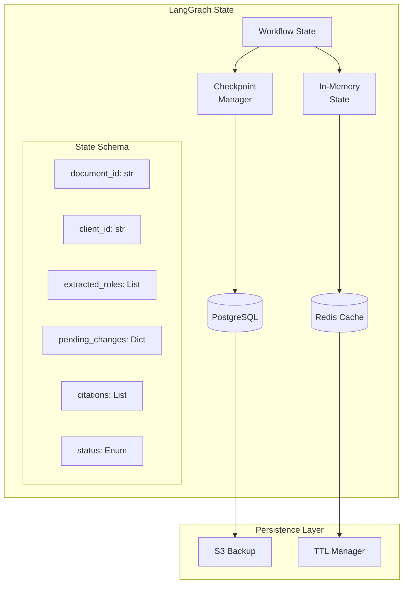
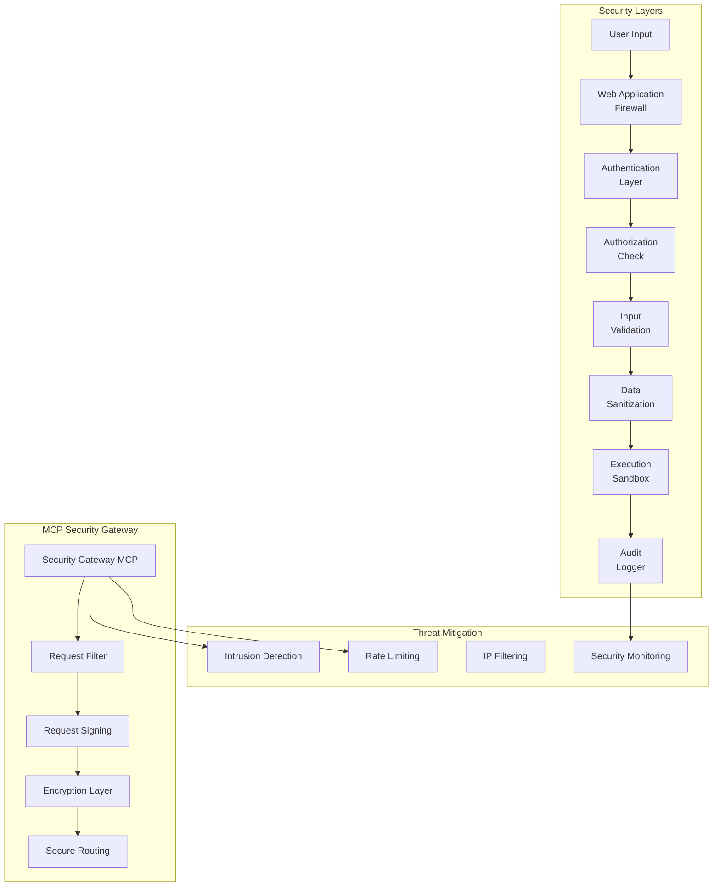
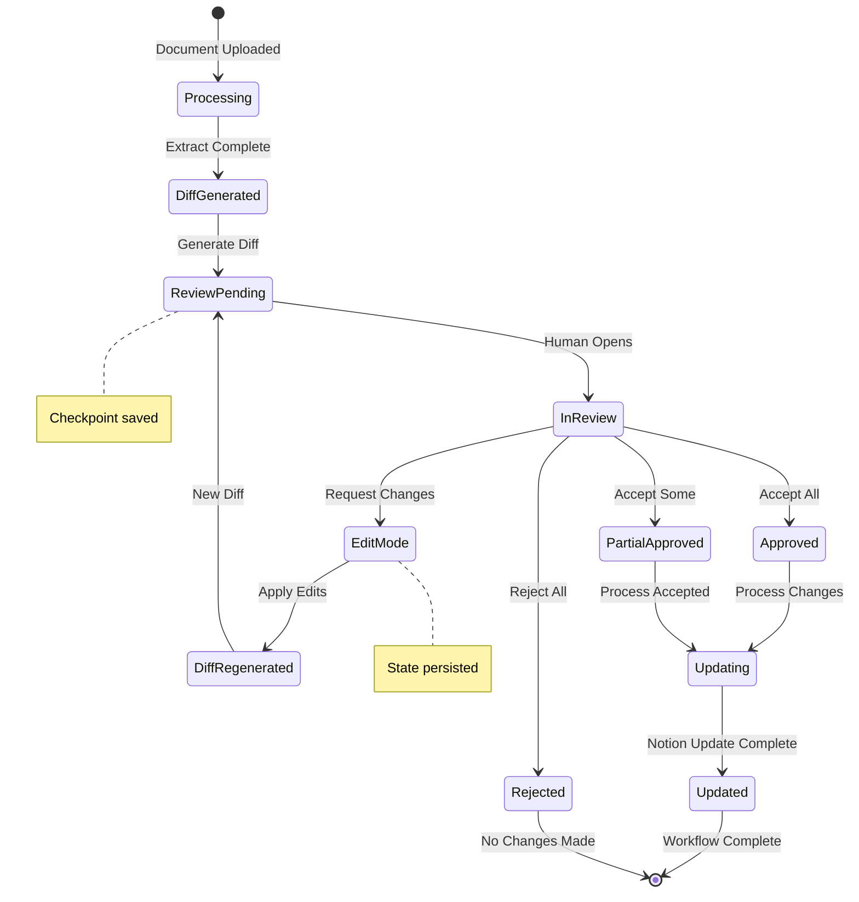
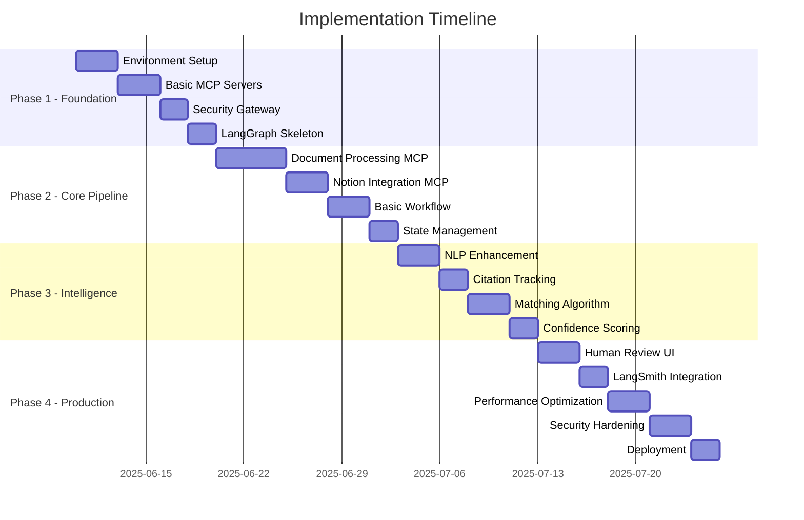
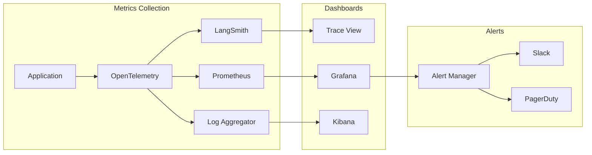

This page outlines the intended final architecture target, we are transforming the original template. 

**🏗️ Architecture Diagrams:**

- **System Overview**: Shows how all components connect, with the security gateway (highlighted in red) protecting your MCP servers
- **Data Flow**: Sequential diagram showing exactly how a document moves through your system
- **LangGraph Workflow**: The complete state machine with human review loops

**🔧 Component Details:**

- **MCP Server Internals**: Detailed architecture for document processing and Notion integration
- **State Management**: How LangGraph persists state across interruptions
- **Security Layers**: Multi-layered security architecture to address the vulnerabilities found in our research

**👤 Human Interaction:**

- **Approval Flow**: State diagram showing all possible paths through the review process
- **Edit Loops**: How changes cycle back for re-review

**🚀 Implementation Guide:**

- **Gantt Chart**: 4-week implementation timeline
- **Project Structure**: Complete file organization
- **Code Templates**: Working examples for both LangGraph workflow and MCP servers

The design incorporates all our research findings:

- ✅ Uses the proven `teddynote-lab/langgraph-mcp-agents` template as foundation
- ✅ Implements security gateway to address the 45% vulnerability rate
- ✅ Includes checkpoint persistence for human-in-the-loop workflows
- ✅ Provides proper citation tracking with PostgreSQL
- ✅ Uses Redis for caching to handle performance requirements

**To start building:**

1. Clone the recommended template
2. Follow the project structure in the design
3. Implement the security gateway first (critical!)
4. Build one MCP server at a time, testing each thoroughly
5. Connect them with the LangGraph workflow

Would you like me to dive deeper into any specific component or help you plan the first implementation sprint?

# Resume Automation System - Final Implementation Design

## 🎯 Executive Summary

This design document provides the complete blueprint for building a resume automation system using MCP servers, LangGraph workflows, and LangSmith monitoring. Based on our technical feasibility research, we've incorporated security hardening, proven patterns, and production-ready templates.

---

## 🏗️ System Architecture Overview



---

## 📊 Data Flow Architecture



---

## 🔄 LangGraph Workflow Design



---

## 🔧 MCP Server Detailed Architecture

### Document Processing MCP Server



### Notion Integration MCP Server



---

## 🗄️ State Management Architecture



---

## 🔒 Security Architecture



---

## 👤 Human-in-the-Loop Approval Flow



---

## 🚀 Implementation Phases



---

## 💻 Key Implementation Files

### Project Structure

```
resume-automation/
├── mcp-servers/
│   ├── document-processor/
│   │   ├── server.py
│   │   ├── parsers/
│   │   ├── extractors/
│   │   └── schemas/
│   ├── notion-integration/
│   │   ├── server.py
│   │   ├── client.py
│   │   └── models/
│   ├── citation-tracker/
│   │   ├── server.py
│   │   └── database/
│   └── security-gateway/
│       ├── server.py
│       └── validators/
├── langgraph/
│   ├── workflow.py
│   ├── nodes/
│   ├── state.py
│   └── checkpoints/
├── api/
│   ├── main.py
│   ├── routes/
│   └── middleware/
├── frontend/
│   ├── streamlit_app.py
│   └── components/
└── infrastructure/
    ├── docker-compose.yml
    ├── kubernetes/
    └── terraform/

```

### Core LangGraph Workflow Implementation

```python
# langgraph/workflow.py
from langgraph.graph import StateGraph, END
from langgraph.checkpoint.postgres import PostgresSaver
from langchain_mcp_adapters import MultiServerMCPClient

class ResumeProcessingWorkflow:
    def __init__(self):
        self.workflow = StateGraph(ResumeProcessingState)
        self.mcp_client = MultiServerMCPClient([
            "security-gateway",
            "document-processor",
            "notion-integration",
            "citation-tracker"
        ])
        self._build_graph()

    def _build_graph(self):
        # Add nodes
        self.workflow.add_node("ingest", self.ingest_document)
        self.workflow.add_node("classify", self.classify_document)
        self.workflow.add_node("extract", self.extract_information)
        self.workflow.add_node("match", self.match_roles)
        self.workflow.add_node("validate", self.validate_data)
        self.workflow.add_node("diff", self.generate_diff)
        self.workflow.add_node("review", self.human_review)
        self.workflow.add_node("update", self.update_notion)

        # Add edges
        self.workflow.set_entry_point("ingest")
        self.workflow.add_edge("ingest", "classify")
        self.workflow.add_conditional_edges(
            "classify",
            self.route_by_type,
            {
                "resume": "extract",
                "transcript": "extract",
                "other": "extract"
            }
        )
        # ... additional edges

```

### MCP Server Template

```python
# mcp-servers/document-processor/server.py
from fastmcp import FastMCP, Context
from typing import Dict, Any
import sandboxed_execution

mcp = FastMCP("document-processor")

@mcp.tool()
async def process_document(
    ctx: Context,
    document_path: str,
    document_type: str
) -> Dict[str, Any]:
    """Securely process documents with sandboxed execution"""

    # Security validation
    validated_path = await validate_input(document_path)

    # Execute in sandbox
    async with sandboxed_execution.create_sandbox() as sandbox:
        result = await sandbox.run(
            extract_document_data,
            validated_path,
            document_type
        )

    # Track citations
    citation_id = await ctx.call_tool(
        "citation-tracker",
        "track_source",
        source=validated_path,
        extracted_data=result
    )

    return {
        "data": result,
        "citation_id": citation_id,
        "confidence": calculate_confidence(result)
    }

```

---

## 🔍 Monitoring & Observability



---

## 🎯 Success Metrics

1. **Performance Targets**
    - Document processing: < 2 seconds per page
    - End-to-end workflow: < 30 seconds per document
    - API response time: < 200ms p95
2. **Accuracy Goals**
    - Resume parsing accuracy: > 95%
    - Role matching precision: > 90%
    - Citation accuracy: 100%
3. **Operational Metrics**
    - System uptime: > 99.9%
    - Security incident rate: 0
    - Human review time: < 2 minutes per document

---

## 🚦 Getting Started

1. **Clone the starter template**:
    
    ```bash
    git clone https://github.com/teddynote-lab/langgraph-mcp-agents
    cd langgraph-mcp-agents
    
    ```
    
2. **Set up environment**:
    
    ```bash
    cp .env.example .env
    # Add your API keys and configuration
    docker-compose up -d postgres redis
    
    ```
    
3. **Install dependencies**:
    
    ```bash
    poetry install
    # or
    pip install -r requirements.txt
    
    ```
    
4. **Start development servers**:
    
    ```bash
    # Terminal 1: Start MCP servers
    python -m mcp_servers.security_gateway
    
    # Terminal 2: Start API
    uvicorn api.main:app --reload
    
    # Terminal 3: Start Streamlit UI
    streamlit run frontend/streamlit_app.py
    
    ```
    
5. **Run tests**:
    
    ```bash
    pytest tests/ -v
    
    ```
    

---

## 📝 Next Steps

1. **Security Hardening**: Implement all security layers before processing any real data
2. **Template Customization**: Adapt the teddynote-lab template for your specific schema
3. **Model Selection**: Configure appropriate models for each processing stage
4. **Integration Testing**: Thoroughly test MCP server communication
5. **Performance Baseline**: Establish metrics before optimization

Remember: Start simple, test thoroughly, and iterate based on real usage patterns!
